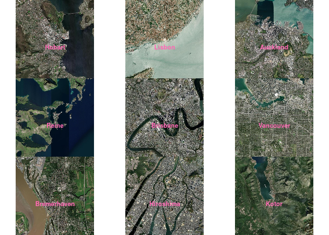

<!-- README.md is generated from README.Rmd. Please edit that file -->

# geotar0

<!-- badges: start -->

<!-- badges: end -->

The goal of geotar0 is to demonstrate a small example of getting imagery
for various places.

We create a target ‘locations’ with a function in “\_targets.R” that is
a dataframe of ‘location,longitude,latitude’ - ‘location’ is just a
name, or address - by default the example provides a set of city names
to {tidygeocoder}, edit this as you like.

## Installation

You can install the development version of geotar0 like so:

``` r
## dependencies ensures we get hypertidy/ximage, which is only Suggests for plotting
remotes::install_github("mdsumner/geotar0", dependencies = TRUE)
```

## Example

This is a basic example which obtains a small quantity of
aerial/satellite imagery from city names.

``` r
targets::tar_make()  ## resulting .tif files are in _targets/tif_files/
#> + loc dispatched
#> Passing 9 addresses to the Nominatim single address geocoder
#> Query completed in: 9 seconds
#> ✔ loc completed [9s, 386 B]
#> + src dispatched
#> ✔ src completed [3ms, 392 B]
#> + ext dispatched
#> ✔ ext completed [0ms, 57 B]
#> + crs declared [9 branches]
#> ✔ crs completed [10ms, 827 B]
#> + llext declared [9 branches]
#> ✔ llext completed [37ms, 722 B]
#> + imfile declared [9 branches]
#> ✔ imfile completed [2s, 26.49 MB]
#> + llxmax declared [9 branches]
#> ✔ llxmax completed [2ms, 495 B]
#> + llxmin declared [9 branches]
#> ✔ llxmin completed [2ms, 495 B]
#> + llymax declared [9 branches]
#> ✔ llymax completed [7ms, 495 B]
#> + llymin declared [9 branches]
#> ✔ llymin completed [1ms, 495 B]
#> + result declared [9 branches]
#> ✔ result completed [31ms, 6.37 kB]
#> ✔ ended pipeline [11.8s, 75 completed, 0 skipped]
library(geotar0)
plot_ims()  ## this plots the images 
#> Loading required namespace: ximage
```



    #> [1] "plotted images from locations Hobart, Lisbon, Auckland, Reine, Brisbane, Vancouver, Bremerhaven, Hiroshima, Kotor"
